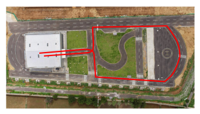
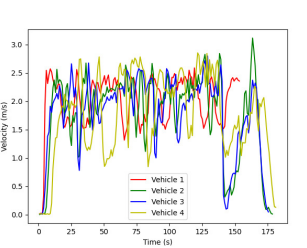
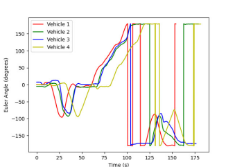
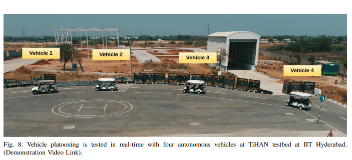
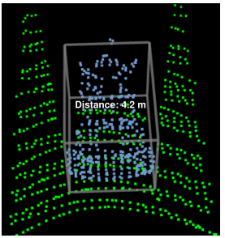

# Autonomous Cooperative Platooning Powered by LiDAR-Guided Adaptive Cruise Control

**Authors:** Abhishek Thakur, C.A. Rakshith Ram, Srivishnu Sathvik, Bhavani Badugu, Swapnil Shinde, and P. Rajalakshmi  
**Affiliation:** Department of Electrical Engineering, Indian Institute of Technology Hyderabad, India

---

## Overview

This repository contains the work on an autonomous cooperative vehicle platooning system. The system integrates:

- Pre-built High-Definition (HD) LiDAR map
- Shared waypoints
- Onboard LiDAR-based localization
- Adaptive Cruise Control (ACC)

It enables multiple vehicles to follow a common trajectory while maintaining safe inter-vehicle distances, even in GPS-denied environments.

---

## Key Highlights

- LiDAR map-based navigation using shared waypoints
- Accurate vehicle localization using NDT (Normal Distributions Transform) matching
- Real-time Adaptive Cruise Control for safe following distance
- Successfully demonstrated with **4 autonomous vehicles** on the TiHAN testbed at IIT Hyderabad

---

## System Architecture

### 1. Pre-built HD LiDAR Map
A high-resolution point cloud map of the route is created and shared with all vehicles. Waypoints are extracted from this map for coordinated navigation.

### 2. Onboard LiDAR Sensors
- **Velodyne VLP-16** (top-mounted) → Used for localization and mapping
- **LiVOX HAP** (front-mounted) → Used for detecting the vehicle ahead and measuring distance

### 3. LiDAR-based Localization
Current LiDAR scans are matched with the pre-built map using **NDT matching** to estimate the precise position and orientation of each vehicle.

### 4. Adaptive Cruise Control
The system continuously measures the distance to the preceding vehicle and adjusts speed accordingly:

- If distance is **too small** → Reduce speed  
- If distance is **too large** → Increase speed  
- If distance is **correct** → Maintain current speed

---

## Experimental Results

The system was tested on the **TiHAN Autonomous Navigation Testbed** at IIT Hyderabad using four vehicles.

### Trajectory Tracking
All vehicles closely followed the planned path while maintaining formation.

### Velocity Profiles
Adaptive Cruise Control successfully coordinated the speeds of all vehicles.

### Heading Synchronization
The vehicles maintained highly similar heading angles throughout the experiment.

### Real-time Platooning Demonstration
Four autonomous vehicles operating in cooperative platooning mode.

### Obstacle Distance Detection (LiVOX)
Front LiDAR detecting the lead vehicle and measuring distance for Adaptive Cruise Control.

---

## Conclusion

This work presents a practical LiDAR-guided platooning framework that enables safe, coordinated, and GPS-independent multi-vehicle driving. The combination of HD mapping, precise localization, and Adaptive Cruise Control provides a strong foundation for future autonomous cooperative driving systems.

---

## Citation

If you use this work, please cite:
